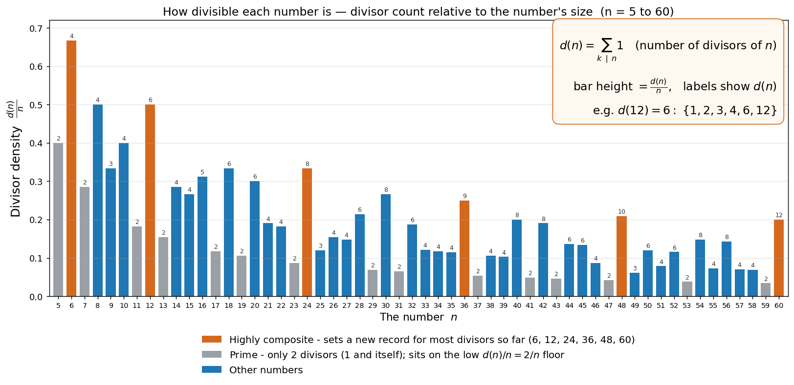

# Dozenal (base 12)

Decimal (base 10) is an accident of anatomy — we have ten fingers. Base 12 is the better choice on its own merits, and it's the base the [fundamental distance unit](fundamental-distance-unit.md) is built on.

Main project repo: [github.com/rubenayla/basekit](https://github.com/rubenayla/basekit) — dozenal research, notation, references, and implementation notes.

## Why twelve

A number base has one real job: to write down the amounts people actually use. And the amounts people use most are **fractions of whole things** — half a loaf, a third of an hour, a quarter cup, three-quarters of the way there.

Here is the catch: whether a fraction comes out as a clean short number or an ugly endless one depends entirely on the base. **A fraction terminates cleanly only when the base divides evenly by its bottom number.** So the more numbers a base divides by — its **divisors** — the more everyday fractions it can write without the digits running off forever. That is the whole case for choosing a base: pick the one that divides nicely.

Twelve divides evenly by **2, 3, 4, and 6**, so the common cuts all land on a single clean digit:

- half = 0;6 · third = 0;4 · quarter = 0;3 · sixth = 0;2 — all exact.

Ten divides only by **2 and 5**. Halves and fifths are fine, but **thirds never terminate** — 1/3 = 0.333… forever — and a third is one of the cuts people make most. That endless third is the everyday tax of counting in tens.

*The orange peaks — 6, 12, 24, 36, 48, 60 — pack in more divisors than any smaller number (the "highly composite" numbers); the grey valleys are primes, which divide by nothing but 1 and themselves.*

??? note "The formal version — counting divisors"
    Let $d(n)$ be the number of whole numbers that divide $n$ evenly, and plot the density $d(n)/n$:

    $$d(n) = \sum_{k \mid n} 1 \qquad\Longrightarrow\qquad \frac{d(n)}{n}\ \text{(the bars above)}.$$

    Each orange bar is a new *record* in divisor count — the **highly composite numbers** (6, 12, 24, 36, 48, 60), which pack more divisors than anything smaller. Primes sit on the low $\tfrac{2}{n}$ floor. Concretely, $d(12) = 6$ (1, 2, 3, 4, 6, 12) against ten's $d(10) = 4$ (1, 2, 5, 10) — and ten wastes two of its four divisors on 5 and itself, where every one of twelve's is a useful everyday cut.

So why not an even *more* divisible base? **Six** has the highest divisibility for its size, but it is too small — everyday quantities keep spilling into two digits (12 becomes "20", 36 becomes "100"), so numbers get longer to read and write. **Twenty-four** has even more divisors but an unwieldy digit set and times tables. **Twelve** lands in the sweet spot: enough divisors, a comfortable digit count.

### The other extreme: base 11

To feel why twelve works, look at its neighbour eleven — a prime, divisible by nothing but 1 and itself. Take a plank one unit long (written `10` in any base, since `10` always means "one whole base") and cut it in half. Where do you mark the pencil?

- **Base 12** — half of `10` is `6`, an exact single digit. Measure six twelfths, mark, cut. Done.
- **Base 11** — half of `10` is `0;5555…`, repeating forever. Eleven is odd, so half of it isn't a whole digit and the fraction never closes. Your own number system can't name where the midpoint goes.

Every everyday fraction breaks the same way in a prime base. Eleven and twelve sit one apart on the number line and could not be further apart in use: the prime is the worst base you could pick for real measuring, the dozen near the best. Ten is the mediocre middle — clean halves, quarters, and fifths, but it chokes on thirds and sixths, the cuts people make most.

??? note "Exact expansions — base 11 vs 12 vs 10"
    In base eleven the everyday cuts all repeat forever:

    $$\tfrac{1}{2}=0.5555\ldots_{11},\quad \tfrac{1}{3}=0.3737\ldots_{11},\quad \tfrac{1}{4}=0.2828\ldots_{11},\quad \tfrac{1}{6}=0.1919\ldots_{11}$$

    In base twelve the same cuts are exact single digits:

    $$\tfrac{1}{2}=0.6_{12},\quad \tfrac{1}{3}=0.4_{12},\quad \tfrac{1}{4}=0.3_{12},\quad \tfrac{1}{6}=0.2_{12}$$

    Base ten terminates halves, quarters, and fifths but not thirds or sixths ($\tfrac{1}{3}=0.333\ldots_{10}$, $\tfrac{1}{6}=0.1666\ldots_{10}$), and even where it terminates it often runs a digit longer (a quarter is $0.25_{10}$ but only $0.3_{12}$). Twelve's one giveaway is fifths, which it loses ($\tfrac{1}{5}=0.2497\ldots_{12}$) — but fifths come up far less than the thirds, quarters, and sixths twelve nails.

    (Fraction expansions verified by exact rational arithmetic; plot from pure divisor counting. The `;` is the dozenal point from the Notation section below; worked fractions use a plain `.` for legibility.)

## Notation

- **Radix point:** a semicolon `;` marks the dozenal point and the fractional part (a long comma in handwriting); say "sub" for the fractional part.
- **Digits past 9:** A and B — so the digits run 0 1 2 3 4 5 6 7 8 9 A B, then `10;` = twelve.
- **Magnitude prefix:** `d3` is the kilo-equivalent (×12³), i.e. `d3 = 10;^3`. Example: 1 dometer = 1000; metres = 1 d3 m = 1;d3 m.
- **Any base, made explicit:** `"last digit of the base"_"number"."fraction"`. E.g. decimal 12.5 = `9_12.5` = `B_10.6` = `F_C.8` (= 0xC.8) = `1_1100.1` (= 0b1100.1).

Preferred-number series, the base-12 analogues of the decimal 1-2-5 series:

- **1-2-4-8 series:** `;1 ;2 ;4 ;8 1 2 4 8 10;`
- **1-2-4-6 series:** `;1 ;2 ;4 ;6 1 2 4 6 10; 20; 40; 60;` … (secondary values to insert: `1;6`, `3`, `8`)
- **Precise series:** `1 → 1;6 → 2 → 3 → 4 → 6 → 8 → 10;` (then 16; 20; 30; 40; 60; 80; 100;). Rule: take a number and add half of it twice to get the next two, then repeat — multiply by 3/2, 4/3, 3/2, 4/3, … — until you reach a dozen times the original.

## Related

- [Fundamental distance unit](fundamental-distance-unit.md) — built on base 12: the unit scales by integer powers of twelve (12^N), so the dozenal "hops" are the only human-chosen part of an otherwise fully physical definition.
