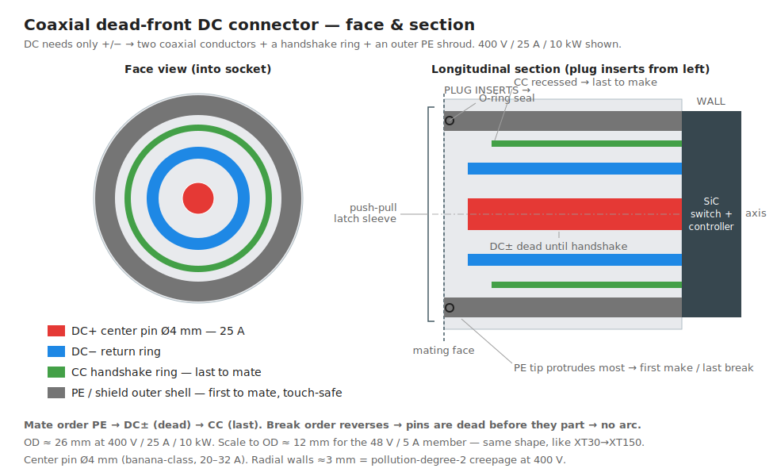
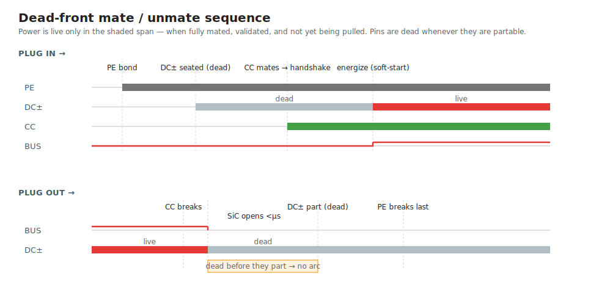
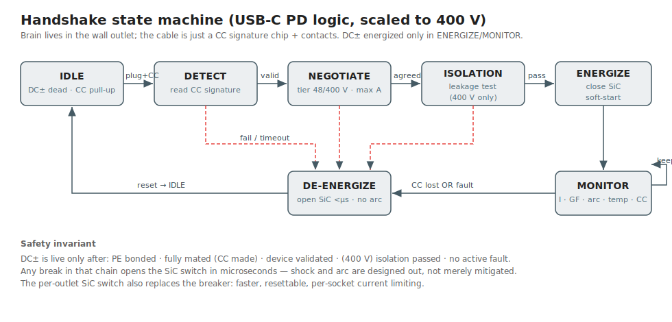
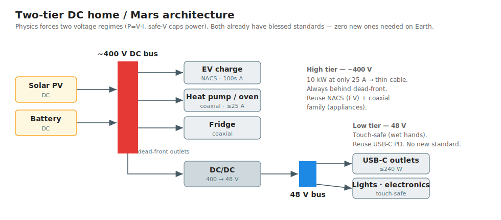

# Power delivery from first principles + ideal DC connector

Related: [Standards](../standards.md) → Electric connectors (Type N, NACS, USB-C, XT family) · [Type N blog post](https://rubenayla.blogspot.com/2020/05/we-should-use-type-n-plugs.html)

A first-principles rebuild of "how should we send power to a domestic load" (vacuum, fridge, etc.). Starts from 230 V AC as the legacy baseline, then backtracks to DC for the long term (think Mars cities — greenfield, no legacy grid). The conclusion: the connector's *brain* and the *voltage architecture* matter far more than the pin silhouette, which is the last 10 %.

## Diagrams

## The job, reduced to physics

Move energy from a fixed point (wall) to a movable load, with a human repeatedly mating/unmating the joint, without electrocution or fire.

`P = V·I`. You can deliver a given power as high-V/low-I or low-V/high-I, and the two choices stress different parts:

- **Current drives heating.** Losses go as `I²R`. Conductor thickness and — critically — *contact* quality are sized by current. The "everything goes loose in Peru → fire" failure is pure `I²R`: bad contact = high R = local heat.
- **Voltage drives shock and insulation.** Breakdown (clearance, through air) and surface tracking (creepage, made worse by dirt+humidity → CTI rating) scale with voltage.

These are separate axes: contact problem set by I, insulation/shock problem set by V.

## Hazards we design against

1. **Shock.** ~10 mA = can't let go; ~50–100 mA through the heart = fibrillation. Wet skin ≈ 1 kΩ, so 230 V wet ≈ 200 mA = lethal; ~50 V is the survivable edge. That line is physics, not convention.
2. **Contact `I²R` heating.** Dominant connector failure mode. Needs high contact force + good plating + metal mass. AC/DC-agnostic.
3. **Arcing on break.** Inductance sustains current as an arc across the opening gap. **AC self-extinguishes** at each zero-crossing (100×/s at 50 Hz); **DC has no zero-crossing** so a DC arc persists — the historical reason DC is hard to switch/unplug.
4. **Tracking / breakdown.** Set by voltage.
5. **Inrush.** Motors pull 5–10× at start; SMPS slam a spike charging the input cap. Contacts must not weld.

## The tension that forces the architecture

Safety caps touch-voltage at ~50 V, and heating caps current. Their product is a capped power → **you cannot have one voltage that is both touch-safe and high-power** (3 kW kettle at 48 V = 62 A, absurd). Two responses exist, every real system is one:

- **(a) Accept the hazard and mitigate** — today's 230 V world: polarize, sleeve, shroud, shutter, earth, breaker.
- **(b) Split into voltage tiers** — a touch-safe low bus + a high-power bus you don't touch live. The honest answer; nobody does it yet because of legacy.

## The two scary hazards collapse into one fix

Shock and arcing are the same problem — an energized conductor exposed when a human or air gap can bridge it. The complete fix for both: **never energize until safely mated, de-energize before separating** = **dead-front** (exposed metal is dead until a handshake confirms full, correct mating). Shrouds/sleeves/shutters are partial mitigations; dead-front is the complete version. It requires the connector to be "active" (have a brain that decides when to switch power on). This is the single highest-leverage decision — worth more than any pin shape.

## AC vs DC, from first principles (not history)

AC won in 1890 for two real reasons, both now obsolete:

1. **Transformers** made AC voltage trivial to change; DC then couldn't. → Killed by cheap, efficient solid-state DC-DC conversion.
2. **Self-quenching arcs** (zero-crossing) made AC switchgear easy. → Killed by solid-state switching + dead-front connectors, which you want for safety anyway.

Meanwhile the world went DC-native: **PV is DC, batteries are DC, and almost every modern load — LED lighting, all electronics, inverter-driven fridge/vacuum motors — rectifies the mains to DC the instant it gets it.** A solar+battery house does AC↔DC round-trips over and over (DC panel → AC inverter → DC supply in each device), each costing a few % and a box of silicon. That redundant waste is the real first-principles case against AC.

DC's honest downsides:

- **Arc interruption** — solved by active/dead-front.
- **Electrolytic corrosion** — steady DC + moisture migrates metal ions and eats *exposed* contacts (AC averages it out). But this only touches the unmated mating face, not cable runs; sealing + plating + dead-front handle the residual.
- "No skin effect / no reactive power" — true but minor at household scale; don't oversell.

**Cable-routing freedom (strong DC win):** an insulated AC cable is a capacitor; AC charges/discharges it continuously, so a charging current flows with no load and eats the conductor rating on long runs — which is why long underground/undersea links are HVDC and overhead AC uses bare conductors on towers. DC charges the cable capacitance once and then nothing — no charging current, no AC dielectric heating. So **you can fully encapsulate DC cable, any length, route/bury it anywhere.** The lever is capacitance + dielectric loss, not corrosion.

**Touch safety (DC win):** at mains frequency, 50/60 Hz AC is near the worst case for fibrillation; DC's threshold is ~2–4× higher in mA. Standards encode it: safe "extra-low" ceiling is **50 V AC vs 120 V DC** (dry; both drop when wet). 48 V is the conservative wet-hands pick.

## Mars: the clarifying greenfield

Mars deletes the only strong remaining argument for AC — legacy infrastructure. Sources are DC (PV, batteries, or a rectified reactor); no 50/60 Hz grid to inherit; a sealed habitat makes fire catastrophic so you want dead-front + solid-state protection everywhere anyway. → Mars lands on **DC, dead-front everywhere.**

## Voltage: two attractor basins

Sit in these, avoid the middle:

- **48 V DC — touchable / low-power.** Highest wet-hands-safe voltage; universal Schelling point (telecom −48, automotive 48, PoE ~48–57, USB-C PD 48). Below it current balloons; above it needs shock protection. Envelope ≈ 240 W on a USB-C-class conductor.
- **~350–400 V DC — high-power.** EV packs (400 V class) and datacenters (380 V DC, Open Compute/ETSI) already converged → ecosystem exists (NACS/CCS, converters, protection). 400 V = **10 kW at just 25 A**, cables/contacts stay sane. 800 V halves current again but raises insulation/hazard — reserve for fast-charge/industrial.
- **Avoid ~60–350 V DC as a resting standard.** Too high to touch, not high enough to justify dead-front's payoff, no ecosystem. (230 V only lives there for legacy AC.) Negotiation may sweep through, don't standardize a tap there.

## How many standards (resolving "two standards is bad")

Physics forces two voltage **regimes** (can't avoid — `P=VI` + safety cap). But the cost can be **zero new standards**:

- **Earth (legacy):** reuse what's already blessed in [Standards](../standards.md) — **USB-C** (≤240 W) + **NACS** (high power; already AC+DC, dead-front-class, latching). The "two" are two *pre-existing* standards, not two inventions.
- **Mars / ideal (greenfield):** anti-new-standard logic is weakest with no legacy. The one place inventing a single unified connector is justified — *because it eliminates all the previous ones* (the stated dream). One connector + one protocol + **voltage negotiated like USB-C PD** (5→48 V), ceiling raised to 400 V. The two regimes become two negotiated states of ONE standard.

## Connector shape

Key unlock: **dead-front deletes most of the geometry problem.** Metal never live when exposed → no deep shrouds, no sleeved pin bases, no arc-rated profiles, no geometric polarization. Shape is then free to optimize contact reliability + sealing + ergonomics. And **DC needs only 2 power conductors (+/−)** vs AC's 3 (L/N/E) — which resurrects coaxial.

**Recommendation: circular coaxial, push-pull self-latching, single-O-ring, dead-front.**

- **Concentric conductors:** center pin = +, outer ring = −, thin intermediate ring = handshake/PE. Two power conductors map perfectly onto coaxial (why coaxial fails for AC's 3 wires but wins for DC's 2).
- **Rotationally symmetric → reversible at any angle.** Beats USB-C's two-way; never orient it. Polarity set electrically by handshake, so symmetry is safe.
- **Push-pull latch (Lemo/Fischer-style):** push in → tactile **click = fully seated**, and only then does the handshake complete and power energize (seating-tied-to-power interlock → half-insertion is dead by construction). Pull outer sleeve to release; no twisting a stiff cable.
- **One circular gasket** → wet/dust-proof (Mars regolith, bathrooms, outdoors).
- **Self-shielding** (outer shields inner) → low EMI.
- **Scale by diameter into a family** — same XT30→XT150 pattern: same shape, bigger = more current. One geometry spans charger → appliance.
- **Contacts:** sprung beryllium-copper female (hyperboloid cage on the round center pin) for low, stable resistance under load; silver-plated power surfaces, gold flash on handshake ring. Phosphor-bronze (CuSn6) as the cost-down spring.
- **Limit:** coaxial traps inner-conductor heat → happy to ~25 A / 10 kW (all home appliances). Above that (EV fast-charge, 100s of A) separated side-by-side pins cool better → NACS's domain. Clean division: **coaxial family = home, NACS = EV-scale.**

**Variants:**

- **Magnetic dead-front** (MagSafe scaled): self-aligning + breakaway trip-safety (tripped cable releases instead of dragging the appliance). Great on Earth for low/medium power. **On Mars avoid** — iron-rich regolith is magnetic, would collect conductive dust. Mechanical push-pull only there.
- **Genderless** (Anderson/XT90 taste): coaxial push-pull is usually gendered, but dead-front + any-angle reversibility already delivers what genderless chased (either end safe, orientation irrelevant). Accept gendered here.

## Water resistance (IP) — bathrooms, outdoors

Dead-front + circular geometry make this connector unusually good in the wet — arguably its strongest niche:

- **Dead-front means water is safe by default.** An unmated socket's contacts are dead, so water on the face carries no voltage → no shock, no electrolysis. A dead-front DC outlet could legally sit in a shower zone where AC mains is forbidden.
- **It also deletes DC's corrosion problem at the face.** Electrolytic corrosion needs sustained voltage across wet metal; with no voltage until mated, wet exposed contacts don't corrode. The one DC downside flagged earlier evaporates exactly where it would matter most.
- **Circular = trivial to seal.** One continuous radial O-ring, no corners — the reason M12 / Lemo / Buccaneer circular connectors own the waterproof market. A rectangular multi-pin plug can't match it.
- **Two seal cases:**
    - *Mated:* radial O-ring on the plug shell against the socket bore → IP67/IP68 when connected.
    - *Unmated:* a sprung self-closing membrane the plug pushes through, closing on withdrawal (marine-bung style); or a tethered cap. Even if it leaks, the dead contacts only need to drain/dry.
- **Wet-detect interlock:** the isolation check (handshake step 5) refuses to energize on leakage → a flooded socket stays dead.
- **Target IPX6 mated (powerful jets) → IPX7 (brief immersion).** Specced housings (PPS/LCP, hydrolysis-resistant) + TPE cable-entry overmold + gold/silver-plated contacts carry it.

## Dimensions (tentative)

Radial stack from the axis (pollution-degree-2 creepage at 400 V ≈ 3 mm insulation walls; 48 V walls are mechanical minimums, not electrical):

**400 V / 25 A member — OD 26 mm**

| band | material | inner → outer radius |
|---|---|---|
| DC+ center pin | brass | 0 → 2.0 mm (Ø4.0) |
| insulation | PPS / LCP | 2.0 → 5.0 mm |
| DC− ring | brass | 5.0 → 6.5 mm |
| insulation | | 6.5 → 8.5 mm |
| CC ring | CuBe | 8.5 → 9.3 mm |
| insulation | | 9.3 → 10.8 mm |
| PE shell | brass | 10.8 → 13.0 mm (OD 26) |

**48 V / 5 A member — OD 12 mm:** same band order scaled ~0.46×, insulation walls floored at ~1 mm → center pin Ø2.0, PE shell outer radius 6.0.

**Axial / sequencing**

- Engagement depth: ~18–20 mm (400 V) · ~10 mm (48 V).
- Tip stagger (sets mate order): PE tip at 0 · DC± recessed 2 mm · CC recessed 4 mm → PE makes ~4 mm of travel before CC.
- O-ring: 1.5 mm cross-section in a groove at Ø24 mm (400 V) · 1.0 mm at Ø11 mm (48 V).
- Plug body incl. push-pull sleeve + strain relief: ~50 mm long, body OD ~33 mm (400 V) · ~16 mm (48 V).

A CAD pass with real IEC 60664 creepage/clearance tables and a thermal sim would move these.

## Materials (mostly AC/DC-agnostic)

- **Pin (male):** free-machining brass CuZn39Pb (CW614N). Cheap dumb part.
- **Spring contact (female):** NOT brass (relaxes when hot → the Peru fire mode). Phosphor-bronze CuSn6 (cost) or beryllium-copper CuBe2/C17200 (does it right — best stress-relaxation + cycle life, what Stäubli hyperboloid contacts use).
- **Plating:** nickel barrier underneath; **silver** on power (best conductivity, wiping cleans tarnish) or tin (cheap); **gold flash** on signal/handshake (low force, low current, no tarnish, stable R).
- **Insulator:** spec by number — **CTI ≥ 600** (Material Group I, tracking resistance at voltage in damp/dirty conditions), **UL94 V-0**, **glow-wire ~850–960 °C** (mandatory for unattended appliances like a fridge). Thermoset (melamine/phenolic) = best fault-heat safety, no snap-fits; high-temp thermoplastic (PPS, PBT-GF, LCP for fine walls) = moldable latches, good-not-thermoset heat. Soft **TPE/TPU** overmold for strain relief.

## Sizing (conductors & contacts)

Using the [Standards](../standards.md) wire table (2 mm⌀ ≈ 4 mm² ≈ 30 A; 1 mm⌀ ≈ 0.75 mm² ≈ 16 A; 0.5 mm⌀ ≈ 0.25 mm² ≈ 6 A) and ρ_Cu ≈ 0.0172 Ω·mm²/m:

| Tier | V | I | core pin | cable | connector OD |
|---|---|---|---|---|---|
| Low | 48 V | 5 A | Ø2 mm | 0.5 mm² (≈20–22 AWG) | ≈ 12 mm |
| High | 400 V | 25 A | Ø4 mm | 2.5–4 mm² (≈14–12 AWG) | ≈ 26 mm |

- **High tier is sized by heat, not voltage drop.** 25 A over 5 m of 2.5 mm² drops ~1.7 V = 0.4 %. Negligible.
- **The whole case for the high tier, in one number:** the same 10 kW at 48 V would be **208 A → ~70 mm² cable** (garden-hose thick). 400 V buys an 8× thinner conductor.
- **Low tier is drop-limited, not heat-limited:** 5 A / 3 m / 0.5 mm² ≈ 1 V ≈ 2 %. That's why you don't stretch 48 V to high power.
- **Center pin Ø4 mm** is banana-plug class, rated 20–32 A — carries the 25 A and sets the connector's core dimension. Ø2 mm is plenty for 5 A.
- **Contact spec is force-over-life, not area.** At 25 A a 1 mΩ contact dissipates 0.6 W locally — fine if the spring holds force, lethal if it relaxes (the Peru fire). → beryllium-copper hyperboloid (Multilam) female on the round pin: many parallel line-contacts, stable mΩ, thousands of cycles. Above ~25 A / 10 kW the inner conductor's trapped heat says hand off to NACS's coolable side-by-side pins.

## Handshake protocol (USB-C PD logic, scaled to 400 V)

Reuse, don't invent: USB-C CC (configuration channel) logic + a CCS-style isolation check. The brain lives in the **wall outlet**; the cable stays cheap (signature chip + contacts).

1. **IDLE** — DC± dead; PE shell + a tiny safe sense voltage on CC (Rp pull-up).
2. **Mate** — PE makes first (bond), DC± seat *dead*, CC makes **last** (its recess = "fully seated" proof).
3. **DETECT** — device presents a known CC signature (resistor for dumb loads, chip for smart).
4. **NEGOTIATE** — device states tier (48/400 V) + max current over CC.
5. **ISOLATION CHECK** (400 V only) — verify no leakage before closing, like CCS before contactor close.
6. **ENERGIZE** — close the SiC solid-state switch with **soft-start** (ramps voltage → swallows inrush, no weld).
7. **MONITOR** (loop) — current, ground-fault, arc-fault, over-temp, CC keepalive.
8. **Unplug** — CC breaks **first** → SiC opens in **microseconds** → DC± separate already dead (no arc) → PE breaks last.

Invariant: **DC± is live only when fully mated + validated + fault-free.** Shock and arc are designed out, not mitigated. The per-outlet SiC switch also replaces the breaker — faster, resettable, per-socket.

## The inversion (the takeaway)

We spent the conversation optimizing the pin when the load-bearing choices were the connector's **brain** (passive-mitigated vs active dead-front) and the **voltage architecture** (legacy 230 AC vs tiered DC). Pick dead-front and one move solves shock + arcing + reversibility *and* makes AC-vs-DC a flip-a-bit system choice. Geometry is the last 10 %.

- **Earth, today:** Type-N-class passive plug with sprung CuBe contacts, sleeved pins, earth-first sequencing, detent-click — the "mitigate accepted hazard" answer, correct *while stuck on legacy AC*. Build it dead-front-ready.
- **Long term / Mars:** tiered DC (48 V + ~400 V), universal dead-front, one unified coaxial push-pull negotiating connector family that subsumes mains/USB-C/barrel/EV.
