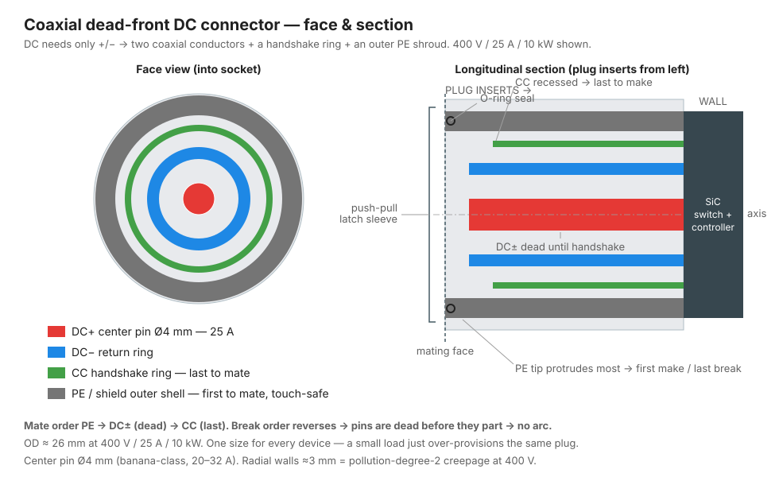
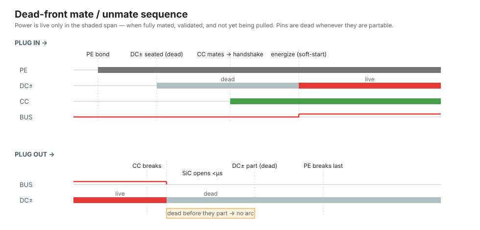
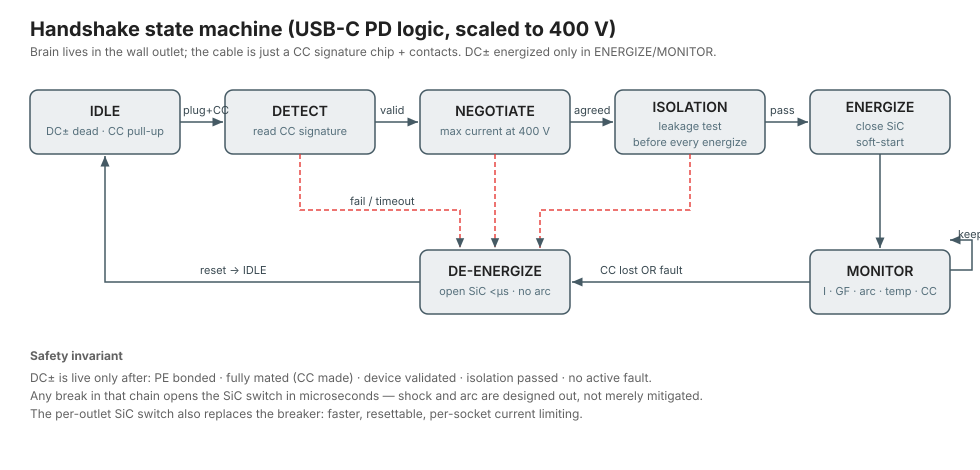
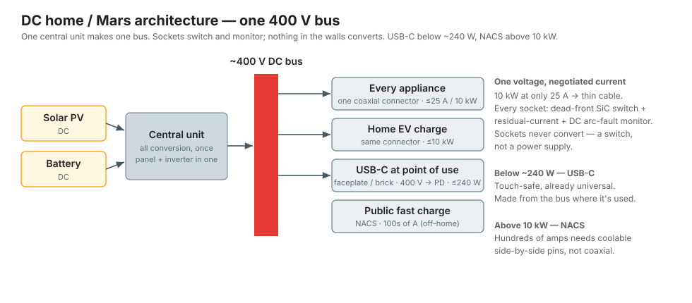

# Power delivery from first principles + ideal DC connector

The goal: design the best way to deliver power for everyday use — the plug you use at home dozens of times a day for a vacuum, fridge, lamp, or laptop. Maybe factories too, though that's less certain (higher power, rougher conditions).

This works it out from scratch. It starts from 230 V AC as today's baseline, then argues for DC in the long run — including places with no grid to inherit, like a Mars city. The conclusion: the connector's control logic and the choice of voltage matter far more than the pin shape.

## The connector in brief

| Feature | What it is | Why |
|---|---|---|
| **Shape** | circular coaxial, push-pull self-latching | [why](#shape) |
| **Control** | active — a handshake switches power on only when fully mated, off before it separates. Every device negotiates (a ~$0.30 chip); no valid signature → the socket stays dead | [why](#decision-1-active-dead-front-the-connector-switches-its-own-power) |
| **Current** | DC | [why](#decision-2-dc-not-ac) |
| **Voltage** | one: **~400 V DC**, current negotiated up to 25 A (10 kW). Low power (below ~240 W) is USB-C's job, converted from the bus at the point of use | [why](#decision-3-one-voltage-400-v-dc) |
| **Conductors** | 4, from the center out: + pin, − ring, a handshake ring, and an outer earth shell (which also shields) | [why](#shape) |
| **Orientation** | reversible at any angle | [why](#shape) |
| **Size** | one size, ~26 mm outer diameter, built for the home max (400 V, 25 A); small loads use the same plug, over-provisioned | [why](#shape) |
| **Sealing** | single O-ring, IPX6–IPX7 (wet and dust) | [why](#water-resistance-ip-bathrooms-outdoors) |
| **Materials** | brass pin, beryllium-copper spring contacts, silver/gold plating, PPS/LCP insulator | [why](#materials) |
| **Range** | from where USB-C ends (~240 W) to where NACS begins (~25 A / 10 kW) | [why](#shape) |

## Decisions at a glance

The whole design in five points, each explained below.

1. **Active dead-front** — the metal stays dead until a handshake confirms full mating. Removes both shock and arcing.
2. **DC, not AC** — the two reasons AC won in 1890 are obsolete, and most loads already run on DC inside.
3. **One voltage** — ~400 V DC at every socket, current negotiated up to 25 A (10 kW). No second voltage in the walls; low power stays on USB-C, made from the bus at the point of use.
4. **No new standards on Earth** — USB-C up to 240 W, NACS for EV fast charge. One negotiating connector for the gap between them where there's no legacy (Mars).
5. **The connector shape comes last** — circular coaxial, push-pull, dead-front. Easy once the above are settled.

## Diagrams

---

## Part 1 — The architecture

### The physics it rests on

The job: move energy from a fixed point (the wall) to a movable load, with a person plugging and unplugging the joint repeatedly, without electrocution or fire.

`P = V·I`. You can deliver the same power as high-voltage/low-current or low-voltage/high-current. The two choices stress different things:

- **Current drives heating** (`I²R`). Conductor thickness and, above all, *contact* quality are sized by current.
- **Voltage drives shock and insulation.** Breakdown through air (clearance) and surface tracking (creepage, worse with dirt and humidity → CTI rating) scale with voltage.

Everything else follows from these two and the hazards they create.

??? note "The five hazards we design against"
    1. **Shock.** ~10 mA = can't let go; ~50–100 mA through the heart = fibrillation. Wet skin ≈ 1 kΩ, so 230 V wet ≈ 200 mA = lethal; ~50 V is the survivable edge. That line is physics, not convention.
    2. **Contact `I²R` heating.** The main connector failure mode. Needs high contact force, good plating, and metal mass. Same for AC and DC. (The "everything goes loose in Peru → fire" failure is pure `I²R`: bad contact = high R = local heat.)
    3. **Arcing on break.** Inductance sustains current as an arc across the opening gap. **AC self-extinguishes** at each zero-crossing (100×/s at 50 Hz); **DC has no zero-crossing**, so a DC arc persists — the historical reason DC is hard to switch and unplug.
    4. **Tracking / breakdown.** Set by voltage.
    5. **Inrush.** Motors pull 5–10× at start; switching supplies draw a spike charging the input cap. Contacts must not weld.

??? note "Why one voltage can't be both touch-safe and high-power"
    Safety caps the touch voltage at ~50 V; heating caps the current. Their product is a capped power, so **no single voltage is both touch-safe and high-power** (a 3 kW kettle at 48 V draws 62 A). Two responses, and every real system picks one:

    - **(a) Accept the hazard and mitigate** — today's 230 V world: polarize, sleeve, shroud, shutter, earth, breaker.
    - **(b) Split** — a touch-safe low-power domain plus a high-power one you never touch live. The touch-safe half already exists and is universal: **USB-C**. So the split costs nothing new — distribute only the high-power voltage, and make USB power from it at the point of use.

    This is what forces the dead-front control (Decision 1) and the division of labor with USB-C (Decision 3).

### Decision 1 — Active dead-front (the connector switches its own power)

**Verdict:** the exposed metal is never live. It powers up only after a handshake confirms full, correct mating, and powers down *before* separating. This is the most important decision here — more than the pin shape.

??? note "Why — shock and arcing are the same problem"
    Shock and arcing are the same problem: an energized conductor exposed when a person or an air gap can bridge it. The fix for both: never energize until safely mated, de-energize before separating. That is dead-front — exposed metal stays dead until a handshake confirms full, correct mating.

    Shrouds, sleeves and shutters are partial fixes; dead-front is the full one. It needs an active connector — one that decides when to switch power on. With it, two of the five hazards (shock and arcing) are removed rather than mitigated. As Decision 2 shows, it also removes the last real obstacle to DC.

??? note "Why unplugging a live connector is safe"
    It relies on the electronics cutting power, with the geometry guaranteeing the order — not on the shape interrupting current by itself.

    1. The handshake ring is **recessed deepest**, so on withdrawal it is always the *first* contact to break. That order is set by geometry, not by timing luck.
    2. Losing the handshake is the trigger: the outlet's SiC switch opens in **microseconds**, killing the DC rings while they are **still inside the shell**, not yet exposed.
    3. The DC power rings then separate a few mm later — **milliseconds** at hand speed — already dead. No arc, and nothing live is ever exposed.

    The margin is huge: microseconds to switch off versus milliseconds of travel to separate. So we don't ask the shape to break current (that's the AC-arc problem) — we ask the electronics to break it and the shape to sequence the trigger first. The same interlock makes half-insertion safe: the handshake is the last contact to make, so power never comes on until seating is complete.

    If the switch failed shorted, the rings would separate live — so they stay shrouded through the break (a failed switch arcs *inside* the shell, not at the exposed face) and the handshake loop monitors continuously. The active switch is the primary safety; the shroud is the backstop.

### Decision 2 — DC, not AC

**Verdict:** where there's no existing grid to match, use DC. The two reasons AC won in 1890 are both obsolete, and most loads already run on DC internally.

??? note "Why — the 1890 reasons are dead and loads are DC anyway"
    AC won in 1890 for two real reasons, both now obsolete:

    1. **Transformers** made AC voltage easy to change; DC then couldn't. → Solved by cheap, efficient solid-state DC-DC conversion.
    2. **Self-quenching arcs** (zero-crossing) made AC switchgear easy. → Solved by solid-state switching and dead-front connectors, which you want for safety anyway.

    Meanwhile most loads are DC inside: **PV is DC, batteries are DC, and nearly every modern load — LED lighting, all electronics, inverter-driven fridge and vacuum motors — rectifies the mains to DC the moment it arrives.** A solar-plus-battery house then does AC↔DC round-trips over and over (DC panel → AC inverter → DC supply in each device), each losing a few percent in a box of silicon. That repeated waste is the main case against AC.

??? note "DC's real downsides (and how they're handled)"
    - **Arc interruption** — solved by active/dead-front (Decision 1).
    - **Electrolytic corrosion** — steady DC plus moisture migrates metal ions and eats *exposed* contacts (AC averages it out). But this only touches the unmated mating face, not cable runs; sealing, plating and dead-front handle the rest.
    - "No skin effect / no reactive power" — true but minor at household scale; don't oversell it.

    **Cable routing (a real DC win):** an insulated AC cable is a capacitor; AC charges and discharges it continuously, so a charging current flows with no load and eats into the conductor rating on long runs. That's why long underground and undersea links are HVDC and overhead AC uses bare conductors on towers. DC charges the cable capacitance once and then nothing — no charging current, no AC dielectric heating. So **you can fully encapsulate DC cable, any length, and route or bury it anywhere.** The cause is cable capacitance and dielectric loss, not corrosion.

    **Touch safety (a DC win):** at mains frequency, 50/60 Hz AC is near the worst case for fibrillation; DC's threshold is ~2–4× higher in mA. Standards reflect this: the safe "extra-low" ceiling is **50 V AC vs 120 V DC** (dry; both drop when wet).

??? note "Mars: no legacy to inherit"
    Mars removes the one strong argument left for AC: existing infrastructure. The sources are DC (PV, batteries, or a rectified reactor), there's no 50/60 Hz grid to match, and a sealed habitat makes fire catastrophic, so you want dead-front and solid-state protection everywhere regardless. So Mars ends up **DC, dead-front everywhere.**

### Decision 3 — One voltage: ~400 V DC

**Verdict:** distribute a single voltage, **~350–400 V DC**, at every socket, with current negotiated up to 25 A (10 kW). No second voltage anywhere in the walls. Low power (below ~240 W) belongs to USB-C, made from the bus at the point of use.

??? note "Why 400 V and not something else"
    - **The parts and the precedent exist.** EV packs (400 V class) and datacenters (380 V DC, Open Compute/ETSI) already converged here, so switches, converters and protection are commodity. 800 V halves the current again but raises insulation and hazard — keep it for fast-charging and industrial.
    - **10 kW at only 25 A** keeps cables and contacts reasonable. The same 10 kW at 48 V would be 208 A → ~70 mm² garden-hose cable.
    - **Insulation is the same class as today's.** 230 V AC peaks at 325 V every cycle; 400 V DC is only ~23 % higher, within the same IEC 60664 design levels. No exotic materials.
    - **Not something lower.** 60–350 V is too high to touch but buys no more power headroom than 400 V parts already give, and has no ecosystem (230 V only sits there for legacy AC).

??? note "Why there is no 48 V tier (earlier versions had one)"
    Earlier versions of this design distributed a touch-safe 48 V tier alongside 400 V. Every way to deliver it loses:

    - **A 400→48 V converter in every socket:** for 48 V to be genuinely touch-safe it must be galvanically isolated from the bus (a non-isolated buck puts 400 V on the "safe" pins the first time a transistor fails shorted). A converter that serves the connector's full 25 A at 48 V (1.2 kW, isolated) is ~$30–50 of parts dissipating 25–35 W in a closed wall box — a real power supply, and a failure point, hidden in every one of ~40 sockets per home.
    - **A second 48 V bus from the central unit:** workable (~$100–300 of extra copper, four power conductors at every box), but it duplicates something that already exists…
    - **USB-C already owns low power.** Below 240 W there is nothing to invent: the ecosystem, the negotiation and the touch-safe connector all exist and are universal. A 48 V tier on this connector would compete with USB-C in the one range where USB-C already won.

    So low power is USB-C, fed from the 400 V bus by converters at the point of use — a faceplate or a brick, which is today's charger minus its rectifier front-end. The new connector's scope is exactly the gap: **from where USB-C ends to where NACS begins.**

??? note "Cord safety without a touch-safe tier"
    The 48 V tier's real job was the damaged-cord case: vacuums, tools and blenders whose cords get yanked, pinched and rolled over now carry 400 V. Three layers cover it:

    1. **Residual-current monitoring per socket** trips at milliamp leakage in milliseconds — a damaged cord de-energizes before it is a shock hazard. Same protection class as today's 230 V handhelds behind an RCD (residual-current device), but per-socket and faster.
    2. **DC arc-fault detection.** This is the failure DC is genuinely worse at: a DC arc has no zero-crossing to self-extinguish, so a damaged cord is a fire risk. The solar industry solved detection at 400 V DC years ago (arc-fault interrupters are mandatory in PV); the same silicon goes in every socket.
    3. **Dead-front** covers the connector interface itself. EV charging already proves untrained people can handle monitored 400 V cables in the rain.

    Net: no worse than today's 230 V world, and safer at the connector.

??? note "10 kW at every socket is a feature, not headroom"
    Today's appliances are designed *down to the plug*: the same kettle sells at 3 kW in the UK (13 A plug) and 1.5 kW in the US (15 A × 120 V); hairdryers cluster at 1.8–2.2 kW because that's what the weakest common socket delivers. Give every socket 10 kW and appliances follow — a kettle that boils a liter in ~40 s, faster dryers, real power tools indoors.

    The limits that remain are the honest ones, and neither is the connector:

    - **Cord and device physics.** 25 A needs ~4 mm² conductors, so a 10 kW handheld drags an EV-grade cable and carries its own mass. Ergonomics caps handhelds below the connector's limit — the right place for that limit to live.
    - **Home service capacity.** Several 10 kW sockets can't all fire at once on a normal supply. But sockets *negotiate*: the central unit grants what's available and a device throttles or waits instead of tripping a circuit dark. Load management becomes a protocol feature instead of a failure mode.

??? note "Does a vacuum really run at 400 V? Yes — worked example"
    A corded vacuum is ~1–2 kW → **2.5–5 A at 400 V**: thin cable, small pin. (At 48 V the same power would be 21–42 A — one reason the touch-safe tier lost its place.)

    **Is 400 V DC unreasonable for a home appliance? No — three reasons:**

    1. **It's barely above today's mains.** 230 V AC *peaks at 325 V* every cycle; 400 V DC is only ~23 % higher. Insulation, creepage and clearance for 400 V DC are essentially the **same class** as a 230 V AC appliance (IEC 60664 already designs 230 V mains for 400 V+ working and transient levels). No exotic materials.
    2. **The appliance already runs on it.** A modern vacuum's BLDC/universal-motor drive **rectifies mains to a ~325–400 V DC bus** internally (with power-factor correction, a regulated ~390–400 V bus). Feeding 400 V DC directly just **deletes the rectifier and PFC front-end** — you hand the motor controller the exact bus voltage it already makes.
    3. **You never touch it.** Dead-front (Decision 1) means the 400 V is dead until fully mated and de-energized before separating — you can't touch it live. Today's 230 V AC is the opposite: exposed pins on withdrawal, live sockets. So despite the higher number, the **shock risk is lower**, not higher.

    The cost: the vacuum's cable and connector are on the "don't touch it live" side, so they depend on the interlock and the per-socket monitoring (residual-current + arc-fault, above) working. That's the trade the whole design makes — moving safety from geometry you hope holds to control that keeps the metal dead.

### Decision 4 — Standards: reuse on Earth, one negotiating connector where there's no legacy

**Verdict:** physics splits power delivery into a touch-safe range and a high-power range, but that needn't mean any new standards. On Earth, reuse USB-C and NACS. On Mars, one new connector is worth inventing for the gap between them, because it replaces mains.

??? note "Why — two ranges needn't mean two inventions"
    Physics forces the touch-safe/high-power split (unavoidable — `P=VI` plus the safety cap). But that needn't cost any new standards:

    - **Earth (legacy):** reuse what's already standard (see [Standards](../standards.md)) — **USB-C** (≤240 W) and **NACS** (high power; already AC+DC, dead-front-class, latching). The "two" are two existing standards, not two inventions.
    - **Mars (no legacy):** the case against new standards is weakest here. This is the one place a new connector is worth inventing — for the gap between USB-C and NACS. One connector, one protocol, one voltage (400 V), current negotiated like USB-C PD. USB-C itself persists even on Mars — every laptop and phone brings it — so the invented connector replaces mains, not USB.

??? note "No dumb mode — every device negotiates"
    Earlier versions gave dumb devices a resistor-signature default (USB-C's trick for basic sinks), which made sense when there was a touch-safe 48 V default to hand out. With only 400 V behind the socket there is nothing safe to deliver by default, so:

    - **No valid signature → the socket stays dead.** Power comes on only after the chip negotiates *and* the isolation check passes.
    - Every device carries a negotiation chip (~$0.30). That's not a real cost at this voltage: every load already has electronics — an LED bulb today runs off ~325 V rectified mains through its own driver. A "dumb" 400 V device doesn't exist.
    - Genuinely dumb, chipless devices are USB-C's territory (its resistor default survives there, at touch-safe voltage).

---

## Part 2 — The connector

With the architecture fixed, the pin geometry is the easy part, and dead-front removes most of it.

### Shape

**Dead-front removes most of the geometry problem.** With no exposed live metal, you don't need deep shrouds, sleeved pin bases, arc-rated profiles, or shaped polarization. That frees the shape to optimize contact reliability, sealing, and ergonomics. And **DC needs only 2 power conductors (+/−)** versus AC's 3 (L/N/E), which brings coaxial back into play.

**Recommendation: circular coaxial, push-pull self-latching, single O-ring, dead-front.**

- **Concentric conductors:** four, from the center out — center pin = +, a − ring, a thin handshake (CC) ring, and the outer shell = earth (PE), which also shields. Only the two *power* conductors need coaxial; that's what fails for AC's 3 wires but works for DC's 2.
- **Rotationally symmetric → reversible at any angle.** Better than USB-C's two ways; you never have to orient it. Polarity is set electrically by the handshake, so symmetry is safe.
- **Push-pull latch (Lemo/Fischer-style):** push in → a click means fully seated, and only then does the handshake complete and power come on (seating is tied to power, so a half-insertion is dead by construction). Pull the outer sleeve to release; no twisting a stiff cable.
- **One circular gasket** → wet- and dust-proof (Mars regolith, bathrooms, outdoors).
- **Self-shielding** (outer conductor shields the inner) → low EMI.
- **One connector, one size — the range is handled by negotiation, not by swapping plugs.** It's built once for the home maximum (400 V, 25 A / 10 kW; Ø4 mm center pin, ~26 mm OD, insulated for 400 V). The *same* plug runs a lamp at a fraction of an amp and a 10 kW load at 25 A — current is negotiated electronically (USB-C PD style), so everything intermates. A small load just over-provisions the connector, the way a wall socket powers a phone charger today. This is the whole point: one universal plug, not a family of sizes. The connector is bigger than USB-C because it must carry 25 A — that's the accepted cost of it being the only one you need.
- **Contacts:** sprung beryllium-copper female (hyperboloid cage on the round center pin) for low, stable resistance under load; silver-plated power surfaces, gold flash on the handshake ring. Phosphor-bronze (CuSn6) as the cheaper spring.
- **Limit:** coaxial traps the inner conductor's heat, so it's good to ~25 A / 10 kW (all home appliances). Above that (EV fast-charge, hundreds of amps) separated side-by-side pins cool better — that's NACS's domain. Simple split: coaxial for home, NACS for EV-scale.

??? note "Variants — magnetic and genderless"
    - **Magnetic dead-front** (MagSafe scaled): self-aligning, with a breakaway so a tripped cable releases instead of dragging the appliance. Good on Earth for low and medium power. **Avoid on Mars** — iron-rich regolith is magnetic and would collect conductive dust. Mechanical push-pull only there.
    - **Genderless** (Anderson/XT90 style): coaxial push-pull is usually gendered, but dead-front plus any-angle reversibility already gives what genderless aims for (either end safe, orientation irrelevant). So gendered is fine here.

### Water resistance (IP) — bathrooms, outdoors

Dead-front plus a circular shape make this connector good in the wet, probably its best use:

- **Dead-front means water is safe by default.** An unmated socket's contacts are dead, so water on the face carries no voltage → no shock, no electrolysis. A dead-front DC outlet could legally sit in a shower zone where AC mains is forbidden.
- **It also removes DC's corrosion problem at the face.** Electrolytic corrosion needs sustained voltage across wet metal; with no voltage until mated, wet exposed contacts don't corrode. The DC downside noted earlier goes away exactly where it would matter most.
- **Circular is easy to seal.** One continuous radial O-ring, no corners — the reason M12, Lemo and Buccaneer circular connectors dominate the waterproof market. A rectangular multi-pin plug can't match it.
- **Two seal cases:** *mated* — radial O-ring on the plug shell against the socket bore → IP67/IP68 when connected; *unmated* — a sprung self-closing membrane the plug pushes through, closing on withdrawal (marine-bung style), or a tethered cap; even if it leaks, the dead contacts only need to drain and dry.
- **Wet-detect interlock:** the isolation check (handshake step 5) refuses to energize on leakage, so a flooded socket stays dead.
- **Target IPX6 mated (powerful jets) → IPX7 (brief immersion).** The right housings (PPS/LCP, hydrolysis-resistant), a TPE cable-entry overmold, and gold/silver-plated contacts get there.

### Engineering detail

The numbers behind the recommendation. Open what you need.

??? note "Sizing — one connector, the cable is what varies"
    The connector is built once for the home maximum — **Ø4 mm center pin, ~26 mm OD, insulated for 400 V, rated 25 A**. Only the *cable* changes with what a device actually draws; the plug is identical. Using the [Standards](../standards.md) wire table (2 mm⌀ ≈ 4 mm² ≈ 30 A; 1 mm⌀ ≈ 0.75 mm² ≈ 16 A; 0.5 mm⌀ ≈ 0.25 mm² ≈ 6 A) and ρ_Cu ≈ 0.0172 Ω·mm²/m:

    | Device draw | negotiated current at 400 V | cable gauge (same connector) |
    |---|---|---|
    | Small (lamp, fridge) | well under 1 A | 0.5 mm² (sized by mechanical robustness, not current) |
    | Full load (kettle, home EV) | 25 A | 2.5–4 mm² (≈14–12 AWG) |

    - **Sized by heat, not voltage drop.** 25 A over 5 m of 2.5 mm² drops ~1.7 V = 0.4 %. Negligible.
    - **Why 400 V, in one number:** the same 10 kW at 48 V would be **208 A → ~70 mm² cable** (garden-hose thick). 400 V buys an 8× thinner conductor.
    - **A small device just pairs the same plug with a thinner cable.** A 100 W load draws 0.25 A; it never comes near the full 25 A, but the connector is over-provisioned so it fits every socket.
    - **Center pin Ø4 mm** (banana-plug class, rated 20–32 A) carries the full 25 A and fixes the connector's size for every device.
    - **Contact spec is force-over-life, not area.** At 25 A a 1 mΩ contact dissipates 0.6 W locally — fine if the spring holds force, dangerous if it relaxes (the Peru fire). → beryllium-copper hyperboloid (Multilam) female on the round pin: many parallel line-contacts, stable mΩ, thousands of cycles. Above ~25 A / 10 kW the inner conductor's trapped heat says hand off to NACS's coolable side-by-side pins.

??? note "Dimensions (tentative)"
    Radial stack from the axis, one size for every device (pollution-degree-2 creepage at 400 V ≈ 3 mm insulation walls):

    **The connector — OD 26 mm, rated 400 V / 25 A**

    | band | material | inner → outer radius |
    |---|---|---|
    | DC+ center pin | brass | 0 → 2.0 mm (Ø4.0) |
    | insulation | PPS / LCP | 2.0 → 5.0 mm |
    | DC− ring | brass | 5.0 → 6.5 mm |
    | insulation | | 6.5 → 8.5 mm |
    | CC ring | CuBe | 8.5 → 9.3 mm |
    | insulation | | 9.3 → 10.8 mm |
    | PE shell | brass | 10.8 → 13.0 mm (OD 26) |

    **Axial / sequencing**

    - Engagement depth: ~18–20 mm.
    - Tip stagger (sets mate order): PE tip at 0 · DC± recessed 2 mm · CC recessed 4 mm → PE makes ~4 mm of travel before CC.
    - O-ring: 1.5 mm cross-section in a groove at Ø24 mm.
    - Plug body incl. push-pull sleeve + strain relief: ~50 mm long, body OD ~33 mm.

    A CAD pass with real IEC 60664 creepage/clearance tables and a thermal sim would move these.

??? note "Handshake protocol (USB-C PD logic, scaled to 400 V)"
    Reuse, don't invent: USB-C CC (configuration channel) logic plus a CCS-style isolation check. The control lives in the **wall outlet**; the cable stays cheap (signature chip + contacts).

    1. **IDLE** — DC± dead; PE shell plus a small safe sense voltage on CC (Rp pull-up).
    2. **Mate** — PE makes first (bond), DC± seat *dead*, CC makes **last** (its recess proves "fully seated").
    3. **DETECT** — device presents a valid CC signature (a chip; no signature → the socket stays dead).
    4. **NEGOTIATE** — device states its max current over CC (the voltage is fixed at 400 V).
    5. **ISOLATION CHECK** — verify no leakage before closing, like CCS before contactor close.
    6. **ENERGIZE** — close the SiC solid-state switch with **soft-start** (ramps the voltage → absorbs inrush, no weld).
    7. **MONITOR** (loop) — current, ground-fault, arc-fault, over-temp, CC keepalive.
    8. **Unplug** — CC breaks **first** → SiC opens in **microseconds** → DC± separate already dead (no arc) → PE breaks last.

    Rule: **DC± is live only when fully mated, validated, and fault-free.** Shock and arc are designed out, not mitigated. The per-outlet SiC switch also replaces the breaker — faster, resettable, per-socket.

??? note "Where the voltage is made: one central bus, sockets only switch"
    All conversion is central or at the point of use; **nothing in the walls converts.**

    - **One central home unit** (it replaces the breaker panel and inverter) takes PV, battery, or grid and produces the regulated **400 V DC house bus**. All conversion happens once, here — that's the efficiency win, and it's where the source is managed (PV tracking, battery charge/discharge, grid rectification).
    - **400 V runs to every socket** on thin cable. There is no second bus and no converter in any socket.
    - **Each socket is a switch, not a power supply:** the SiC dead-front gate, the handshake controller, and the monitoring (residual-current, arc-fault, over-temp) — cheap silicon that replaces today's breaker with a smarter, faster, per-socket one. It gates the bus through; it never converts it.
    - **Low voltages are made at the point of use.** A USB-C faceplate or brick converts 400 V → USB-C PD right where it's needed (that brick is today's charger minus its rectifier front-end, so slightly smaller and cheaper). A device on the connector converts 400 V → its internal rails in one step — you never step 400→48 and then 48→5.

## Materials

Mostly the same for AC or DC — a connector cares about heat, contact force, and surface tracking, not whether the current alternates. The one DC-specific point is at the end.

| Part | Material | Why |
|---|---|---|
| Male pin | free-machining brass **CuZn39Pb (CW614N)** | cheap, machinable, plain solid part — conductivity is fine because it isn't the spring |
| Female spring contact | beryllium-copper **CuBe2 / C17200** (or phosphor-bronze **CuSn6** to cut cost) | holds contact force hot over thousands of cycles |
| Plating | **nickel** barrier + **silver** on power / **gold** flash on handshake | conductivity, tarnish, stable low-force resistance |
| Insulator | thermoset (melamine/phenolic) or high-temp thermoplastic (**PPS, PBT-GF, LCP**) | fault-heat safety + moldable walls |
| Seals / strain relief | **HNBR or silicone** O-ring, **TPE/TPU** overmold | temperature + hydrolysis resistance |

The key choices behind that table:

- **The spring must not be brass.** Brass stress-relaxes when it gets hot — it loses clamping force, contact resistance climbs, the joint heats more, and you're on the runaway path that is the "everything goes loose in Peru → fire" `I²R` failure. Beryllium-copper resists stress-relaxation and fatigue best (it's what Stäubli/Multilam hyperboloid contacts use); phosphor-bronze CuSn6 is the cheaper option and gives up some life. This is the most safety-critical material choice in the part.
- **Plating is layered for three jobs.** A nickel underlayer stops the base metal migrating up; **silver** on the power surfaces gives the highest conductivity and self-cleans as the contacts wipe on mating (or tin, if cost matters more); **gold flash** on the low-current handshake ring, where there's no wiping force to break through tarnish, so you need a metal that never tarnishes and holds a stable resistance.
- **The insulator is specified by number, not by name:** **CTI ≥ 600** (Material Group I — resists surface tracking at voltage in damp, dirty air), **UL94 V-0** (self-extinguishing), and **glow-wire 850–960 °C** (mandatory for an unattended appliance like a fridge). Thermoset (melamine/phenolic) has the best fault-heat behaviour but can't do snap-fit latches; high-temp thermoplastic (PPS, PBT-GF, and LCP for the thinnest walls) moulds into latches with good — not thermoset-grade — heat tolerance.
- **The one DC-specific point:** steady DC across a wet, exposed contact drives electrolytic migration that eats the metal (AC averages it out). So the mating face wants corrosion-resistant plating — silver or gold over nickel. But dead-front removes the voltage from the exposed face entirely, so this drops from a primary requirement to a minor one.

---

## Summary

It's easy to focus on the pin shape, but the decisions that matter are the connector's control (passive mitigation vs active dead-front) and the voltage (legacy 230 AC vs one DC voltage). Choosing dead-front solves shock, arcing, and reversibility at once, and makes AC-vs-DC a simple system choice. The geometry is the small part.

- **Earth, today:** a Type-N-class passive plug with sprung CuBe contacts, sleeved pins, earth-first sequencing, and a detent click — the "mitigate the accepted hazard" answer, correct while we're stuck on legacy AC. Build it dead-front-ready.
- **Long term / Mars:** one DC voltage (~400 V, current negotiated to 25 A) through **one** dead-front coaxial push-pull connector — the same plug for lamp, fridge, kettle, vacuum, and home EV charging, replacing mains. USB-C keeps everything below ~240 W; public DC fast-charging (hundreds of amps) stays on NACS.

## See also

- [Standards](../standards.md) → Electric connectors (Type N, NACS, USB-C, XT family)
- [Type N blog post](https://rubenayla.blogspot.com/2020/05/we-should-use-type-n-plugs.html)
