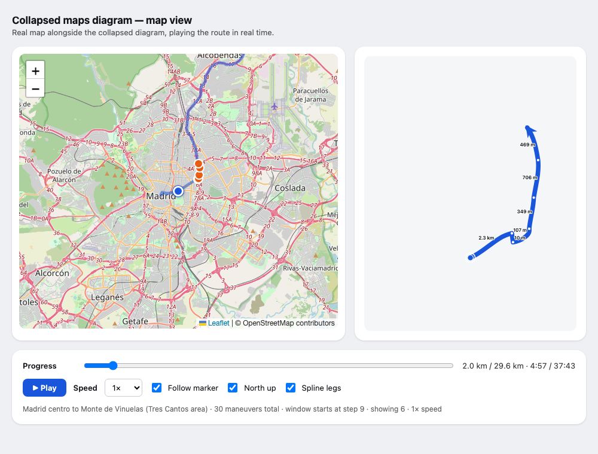
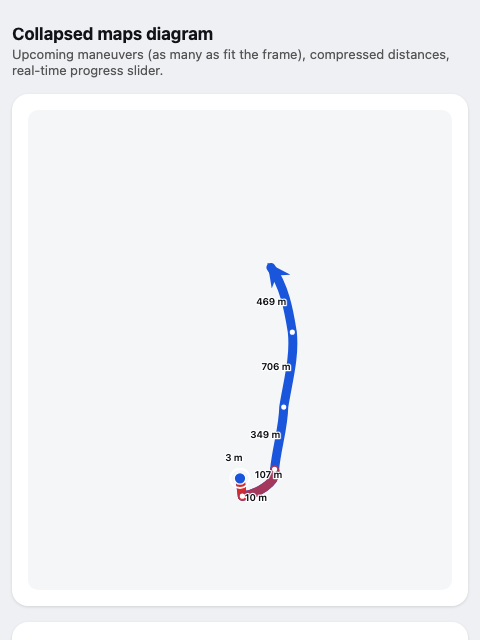

# Prototypes

Working demos of ideas I'm building — runnable in the browser, no install.

## [Collapsed maps diagram](prototypes/maps-collapsed-diagram/map.html)

*Click the image or the title to open the live demo — a real Madrid route (OpenStreetMap, rendered with the Leaflet library) playing at driving speed (1×) or accelerated (10× / 60×), with a progress slider and toggles.*

A navigation overlay that shows the next few maneuvers as one clear diagram. Distances are log-compressed so three turns within 100 m and a 10 km highway leg fit on the same screen, but every drawn angle stays exactly what you see through the windscreen — lengths are the one thing the diagram distorts, angles never. Legs are splines whose end directions follow the real road bearings, the view keeps north pointing up so the picture never rotates under you, and maneuvers turn red as you approach them.

{ width="300" }

Typical navigation apps show one upcoming maneuver at a time; this shows the shape of what's coming — most useful when several exits or turns arrive in quick succession, like the red cluster above.

The route is a fixed test route (Madrid centro → Monte de Viñuelas, 29.6 km), fetched from OSRM (Open Source Routing Machine, a free routing engine); progress is simulated with a slider or clock, not GPS. Prior art for the length distortion: [LineDrive](http://graphics.stanford.edu/papers/routemaps/) (Agrawala & Stolte, SIGGRAPH 2001), which showed that non-uniform route scaling reads well — the sliding real-time window over upcoming maneuvers is the part that's new here.
